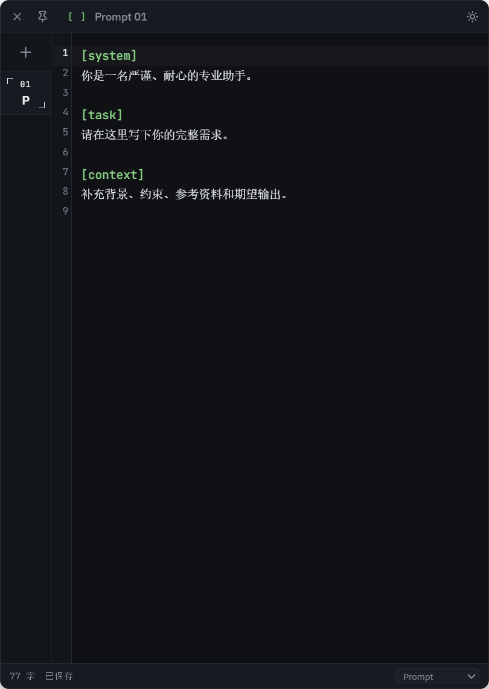
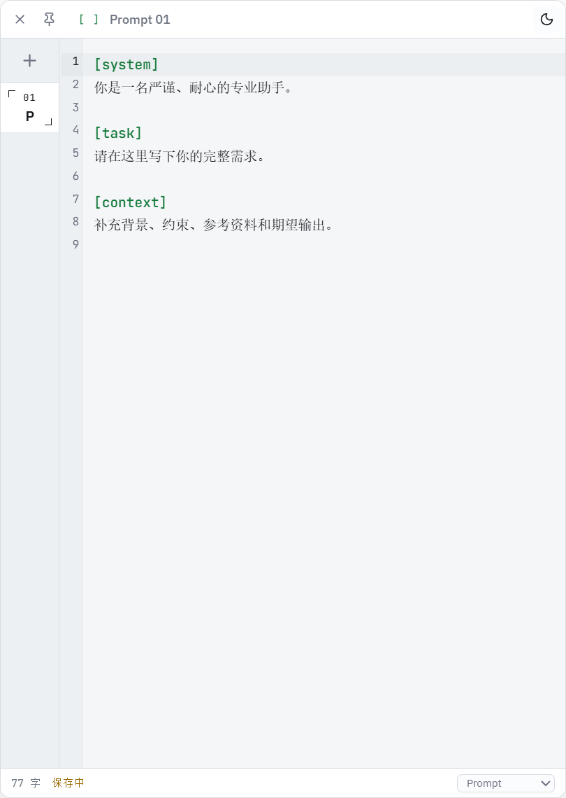
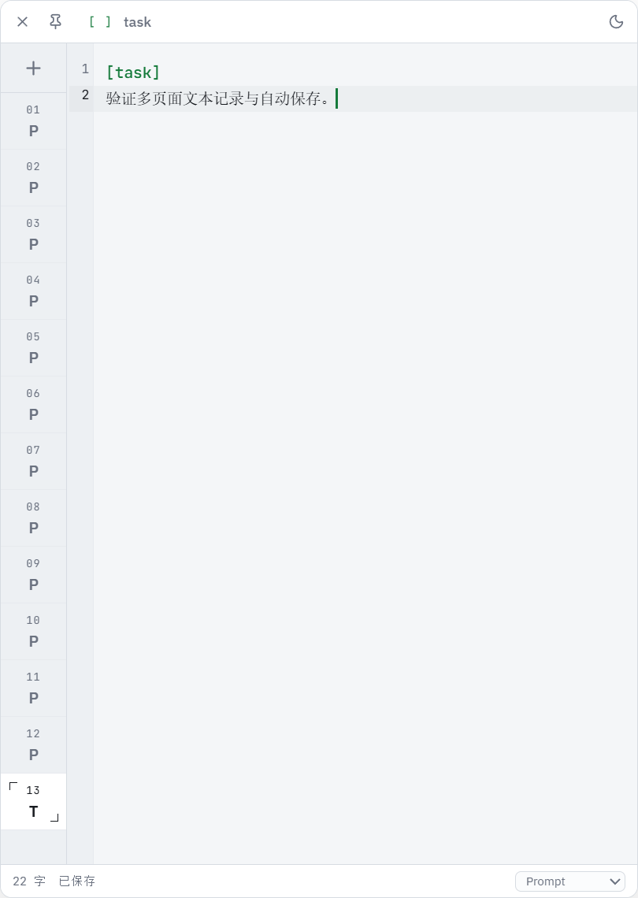

# PromptDock

[](https://github.com/88l1yx/PromptDock/releases/latest)
[](LICENSE)
[](https://github.com/88l1yx/PromptDock/releases/latest)

面向 Windows 的置顶提示词记录器。适合长期编写系统提示词、AI 长文本、Markdown 草稿和多页面临时笔记。

A Windows-first, always-on-top prompt notepad for writing system prompts, AI instructions, Markdown drafts, and multi-page notes without opening a full code editor.

## 界面预览 / Screenshots

| 深色模式 / Dark | 浅色模式 / Light |
| --- | --- |
|  |  |



---

## 简体中文

### 项目作用

PromptDock 解决的是“临时写一大段提示词时，不想专门打开 VS Code 或文本编辑器”的问题。它常驻桌面顶部，支持多页面记录、代码高亮、自动保存、深浅主题，以及贴近屏幕任意一侧后自动收起和展开。

### 主要功能

- 窗口始终置顶，可以自由调整大小。
- 拖入显示器左侧或右侧约 30% 的吸附区域后，自动贴齐对应边缘。
- 鼠标离开窗口约 420ms 后，以 230ms 动画向贴边方向收起为 6px 绿色边缘条。
- 鼠标靠近显示器左缘或右缘时自动展开，任意高度都可以触发。
- 从贴边状态主动拖离后解除吸附，不会在拖动过程中反复弹回。
- 左侧多页面标签栏，加号固定在顶部，标签列表独立滚动。
- CodeMirror 6 编辑器，支持行号、括号匹配、查找替换、撤销重做。
- `[system]`、`[task]` 等中括号内容显示为绿色，`{{variable}}` 显示为琥珀色。
- 支持 Prompt、Markdown、纯文本、JSON 和 JavaScript 语法模式。
- 深色和浅色主题。
- 编辑内容自动保存到 Electron 用户数据目录。
- `Ctrl+Alt+Space` 全局快捷键用于快速显示或隐藏窗口。
- 自定义应用图标和单实例运行。

### 下载与运行

请前往 [GitHub Releases](https://github.com/88l1yx/PromptDock/releases/latest)：

- [PromptDock-Portable-0.2.0-x64.exe](https://github.com/88l1yx/PromptDock/releases/latest/download/PromptDock-Portable-0.2.0-x64.exe)：无需安装，双击即可运行。
- [PromptDock-Setup-0.2.0-x64.exe](https://github.com/88l1yx/PromptDock/releases/latest/download/PromptDock-Setup-0.2.0-x64.exe)：安装版，支持创建桌面快捷方式。

当前安装包未配置商业代码签名证书，Windows 首次运行时可能出现 SmartScreen 提示。

### 使用方式

1. 打开程序后，在编辑区输入提示词。
2. 点击左侧顶部的加号新建页面。
3. 点击左上角图钉可以固定展开，禁止自动收起。
4. 点击左上角关闭按钮退出程序。
5. 将窗口拖到屏幕左侧或右侧，松开后会自动贴边。
6. 鼠标离开后窗口向贴边方向收起，鼠标回到对应屏幕边缘时再次展开。

### 开发

```powershell
npm install
npm run dev
```

类型检查与生产构建：

```powershell
npm run build
```

生成 Windows 安装版和便携版：

```powershell
npm run dist
```

### 技术栈

Electron、React、TypeScript、Vite、CodeMirror 6、Zustand、Lucide React。

### 许可证

[MIT](LICENSE)

---

## English

### What It Does

PromptDock is built for the moment when you need to write a long prompt or AI instruction but do not want to open VS Code or a separate text editor. It stays above other windows, keeps multiple editable pages, provides code-style highlighting, autosaves your work, and can retract into either the left or right edge of the screen.

### Features

- Always-on-top window with free resizing.
- Drag into the leftmost or rightmost ~30% of a display to snap flush with that edge.
- The window collapses toward the docked edge into a 6px green strip after the pointer leaves.
- Move the pointer to any height on the matching left or right display edge to reveal the window.
- Dragging away from the edge releases the dock without repeatedly snapping back.
- Left-side multi-page tab rail with a permanently visible top add button.
- CodeMirror 6 editor with line numbers, bracket matching, search, and undo/redo.
- `[system]`, `[task]`, and similar bracket tags are highlighted green; `{{variable}}` is amber.
- Prompt, Markdown, plain text, JSON, and JavaScript modes.
- Dark and light themes.
- Automatic local persistence through Electron user data.
- `Ctrl+Alt+Space` global shortcut for showing or hiding the window.
- Custom application icon and single-instance behavior.

### Download And Run

Open [GitHub Releases](https://github.com/88l1yx/PromptDock/releases/latest):

- [PromptDock-Portable-0.2.0-x64.exe](https://github.com/88l1yx/PromptDock/releases/latest/download/PromptDock-Portable-0.2.0-x64.exe): portable, run without installation.
- [PromptDock-Setup-0.2.0-x64.exe](https://github.com/88l1yx/PromptDock/releases/latest/download/PromptDock-Setup-0.2.0-x64.exe): installer with desktop shortcut support.

The binaries are not commercially code-signed, so Windows may display a SmartScreen warning on first launch.

### Usage

1. Open the app and type into the editor.
2. Use the plus button at the top of the left rail to create another page.
3. Use the pin button in the top-left corner to prevent auto-collapse.
4. Use the close button in the top-left corner to exit.
5. Drag the window to the left or right side of a display to dock it.
6. When the pointer leaves, the window retracts toward that edge; touch the matching screen edge to reveal it again.

### Development

```powershell
npm install
npm run dev
```

Type-check and production build:

```powershell
npm run build
```

Build Windows installer and portable executable:

```powershell
npm run dist
```

### Stack

Electron, React, TypeScript, Vite, CodeMirror 6, Zustand, and Lucide React.

### License

[MIT](LICENSE)
